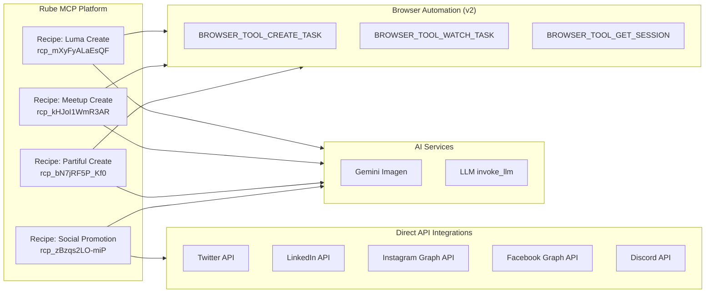
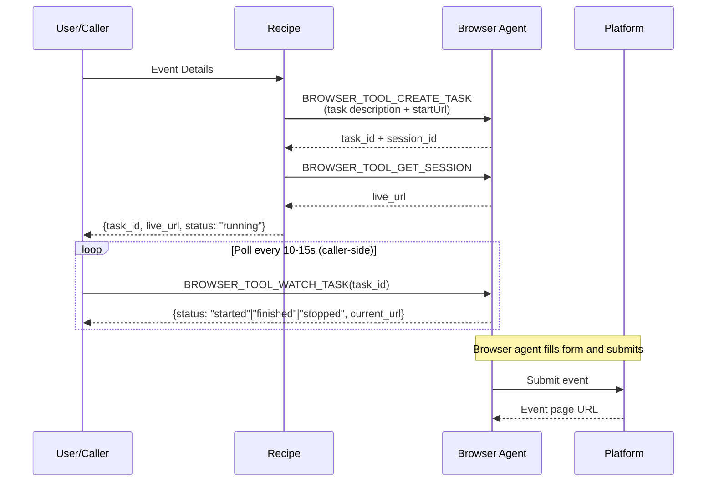
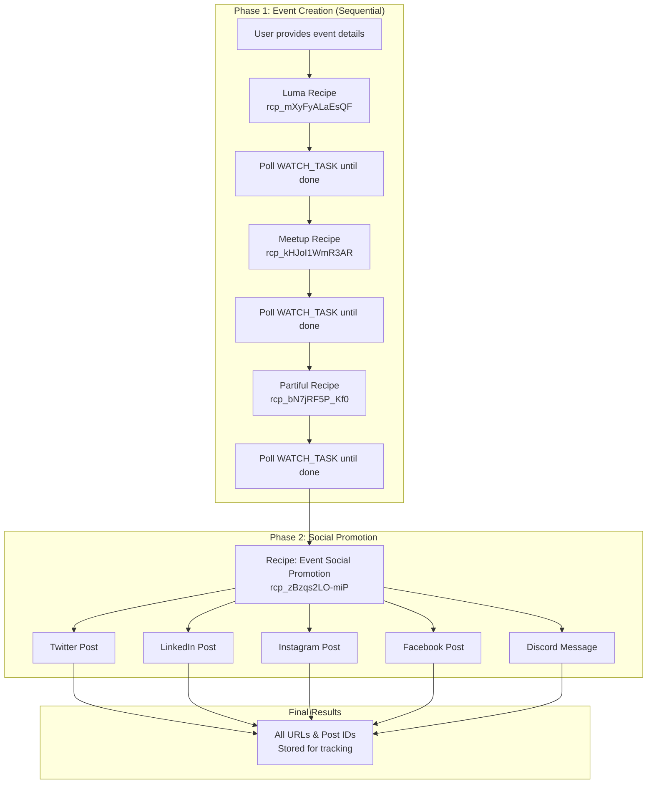
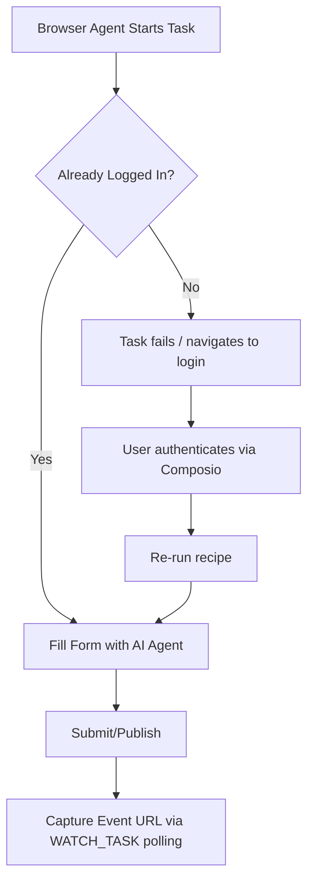

# CCP Digital Marketing Automation

[](https://rube.app)
[](https://composio.dev)
[](https://opensource.org/licenses/MIT)

Automated event creation and social media promotion system for Coffee Code Philly Accelerator. Creates events across multiple platforms and promotes them on social media with AI-generated content.

## Overview

This system automates the entire event lifecycle:
1. **Event Creation** - Sequentially creates events on Luma, Meetup, and Partiful via browser automation
2. **Content Generation** - AI generates promotional images and platform-optimized descriptions
3. **Social Promotion** - Posts to Twitter, LinkedIn, Instagram, Facebook, and Discord


## Architecture

### System Components



## Prerequisites

### Required Accounts
- [Composio Account](https://composio.dev) with Rube MCP access
- Event platform accounts: Luma, Meetup, Partiful
- Social media accounts: Twitter, LinkedIn, Instagram, Facebook Page, Discord Server

### Connected Apps in Composio

| App | Connection Type | Required For |
|-----|-----------------|--------------|
| `BROWSER_TOOL` | Browser Session | Event creation |
| `GEMINI` | API Key | Image generation |
| `TWITTER` | OAuth 2.0 | Social posting |
| `LINKEDIN` | OAuth 2.0 | Social posting |
| `INSTAGRAM` | OAuth 2.0 | Social posting |
| `FACEBOOK` | OAuth 2.0 | Page posting |
| `DISCORD` | Bot Token | Server announcements |

## Quick Start

### Option 1: Via Rube App (Recommended)

1. Open [Rube App](https://rube.app)
2. Navigate to Recipes
3. Run per-platform event creation recipes:
   - Luma: `rcp_mXyFyALaEsQF`
   - Meetup: `rcp_kHJoI1WmR3AR`
   - Partiful: `rcp_bN7jRF5P_Kf0`
4. Fill in event details and run each recipe
5. Poll `BROWSER_TOOL_WATCH_TASK` with the returned `task_id` until finished
6. Copy event URLs from poll results
7. Run "Event Social Promotion" (`rcp_zBzqs2LO-miP`) with the URLs

### Option 2: Via Claude Code with Rube MCP

```bash
# In Claude Code with Rube MCP connected
"Create an event titled 'AI Workshop' on January 25, 2025 at 6 PM
at The Station, Philadelphia. Then promote it on all social platforms."
```

## Recipes

### Recipe 1: Create Event on Luma

**Recipe ID:** `rcp_mXyFyALaEsQF`

Creates an event on Luma (lu.ma) using an AI browser agent.

### Recipe 2: Create Event on Meetup

**Recipe ID:** `rcp_kHJoI1WmR3AR`

Creates an event on Meetup using an AI browser agent.

### Recipe 3: Create Event on Partiful

**Recipe ID:** `rcp_bN7jRF5P_Kf0`

Creates an event on Partiful using an AI browser agent.

#### Event Creation Sequence (all platforms)



#### Input Parameters (all event creation recipes)

| Parameter | Required | Description | Example |
|-----------|----------|-------------|---------|
| `event_title` | Yes | Name of the event | "AI Workshop: Building with Claude" |
| `event_date` | Yes | Date of event | "January 25, 2025" |
| `event_time` | Yes | Start time with timezone | "6:00 PM EST" |
| `event_location` | Yes | Venue or address | "The Station, 3rd Floor, Philadelphia" |
| `event_description` | Yes | Event description | "Join us for a hands-on workshop..." |

#### Output (Phase 1 - immediate return)

```json
{
  "platform": "luma|meetup|partiful",
  "status": "running",
  "task_id": "<use for BROWSER_TOOL_WATCH_TASK>",
  "session_id": "<browser session>",
  "live_url": "https://...",
  "event_url": "",
  "error": null
}
```

---

### Recipe 4: Event Social Promotion

**Recipe ID:** `rcp_zBzqs2LO-miP`
**Recipe URL:** [View on Rube](https://rube.app)

Posts event announcements to 5 social platforms with AI-generated content.


#### Input Parameters

| Parameter | Required | Description | Example |
|-----------|----------|-------------|---------|
| `event_title` | Yes | Name of the event | "AI Workshop" |
| `event_date` | Yes | Date of event | "January 25, 2025" |
| `event_time` | Yes | Start time | "6:00 PM EST" |
| `event_location` | Yes | Venue | "The Station, Philadelphia" |
| `event_description` | Yes | Event description | "Join us for..." |
| `event_url` | Yes | Primary RSVP link | "https://lu.ma/abc123" |
| `discord_channel_id` | No | Discord channel ID | "1234567890" |
| `facebook_page_id` | No | Facebook page ID | "9876543210" |

#### Output

```json
{
  "twitter_posted": "success|skipped|failed: <error>",
  "linkedin_posted": "success|skipped|failed: <error>",
  "instagram_posted": "success|skipped: No image available|failed: <error>",
  "facebook_posted": "success|skipped: No page ID provided|failed: <error>",
  "discord_posted": "success|skipped: No channel ID provided|failed: <error>",
  "image_url": "https://...",
  "summary": "Posted to N/5 platforms"
}
```

---

## Combined Workflow

For a complete event launch, run event creation recipes sequentially, then social promotion:



## Platform Connection Status

Current integration status for each platform:

| Platform | Type | Status | Notes |
|----------|------|--------|-------|
| **Luma** | Browser | Tested | Session persists |
| **Meetup** | Browser | Tested | May need re-auth |
| **Partiful** | Browser | Tested | Session persists |
| **Twitter/X** | API | Working | OAuth connected |
| **LinkedIn** | API | Working | OAuth connected |
| **Instagram** | API | Working | Business account required |
| **Facebook** | API | Partial | Page permissions needed |
| **Discord** | API | Partial | Bot re-authorization needed |

## Authentication Flow



## Troubleshooting

See [docs/troubleshooting.md](docs/troubleshooting.md) for common issues:

- **NEEDS_AUTH status**: Browser session expired, re-login required
- **Form filling fails**: Platform UI changed, update prompts
- **Image upload fails**: Check image URL accessibility
- **Social post fails**: Re-authorize API connections in Composio

## File Structure

```
CCP-Digital-Marketing/
├── README.md                    # This file
├── CLAUDE.md                    # Claude Code guidance
├── docs/
│   ├── event-creation.md        # Detailed event creation docs
│   ├── social-promotion.md      # Detailed social promotion docs
│   └── troubleshooting.md       # Common issues & solutions
├── recipes/
│   ├── luma_create_event.py     # Luma event creation recipe
│   ├── meetup_create_event.py   # Meetup event creation recipe
│   ├── partiful_create_event.py # Partiful event creation recipe
│   └── social_promotion.py      # Social promotion recipe
├── scripts/
│   ├── recipe_client.py         # CLI client for recipe execution
│   ├── requirements.txt         # Python dependencies
│   └── .env.example             # Environment variable template
├── .claude/skills/
│   ├── luma-create/             # Luma event creation skill
│   ├── meetup-create/           # Meetup event creation skill
│   ├── partiful-create/         # Partiful event creation skill
│   ├── social-promote/          # Social promotion skill
│   └── full-workflow/           # Full workflow orchestration skill
└── .gitignore
```

## Contributing

1. Fork the repository
2. Create a feature branch (`git checkout -b feature/improvement`)
3. Commit your changes (`git commit -am 'Add new feature'`)
4. Push to the branch (`git push origin feature/improvement`)
5. Open a Pull Request

## License

MIT License - see LICENSE file for details.

## Support

- **Issues**: Open a GitHub issue
- **Composio**: [composio.dev/docs](https://composio.dev/docs)
- **Rube MCP**: [rube.app](https://rube.app)

---

Built with Rube MCP by Composio for Coffee Code Philly Accelerator
