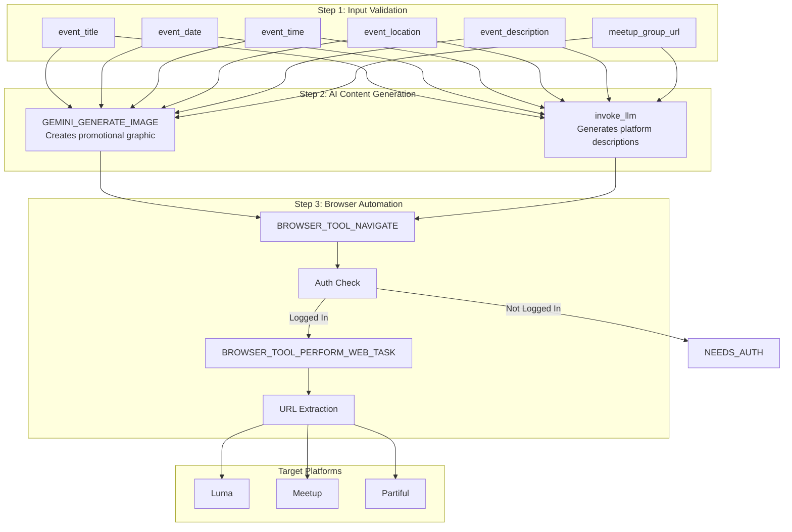
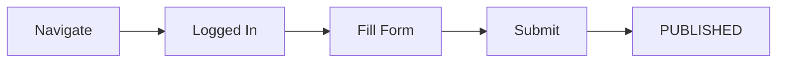
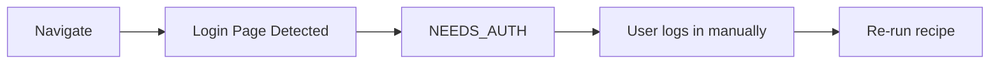
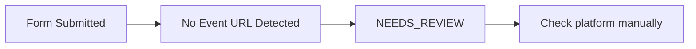
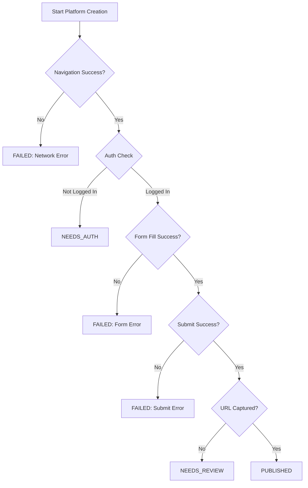
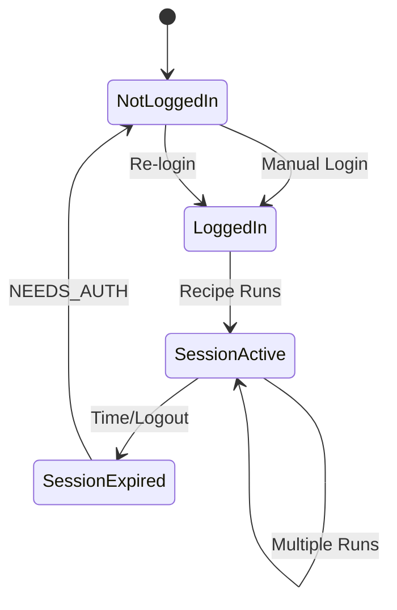

# Event Creation Recipe - Detailed Documentation

**Recipe ID:** `rcp_xvediVZu8BzW`
**Recipe URL:** [https://rube.app/recipes/fa1a7dd7-05d1-4155-803a-a2448f6fc1b2](https://rube.app/recipes/fa1a7dd7-05d1-4155-803a-a2448f6fc1b2)

## Overview

This recipe creates events on three platforms simultaneously using browser automation:
- **Luma** (lu.ma) - Professional event hosting
- **Meetup** (meetup.com) - Community event platform
- **Partiful** (partiful.com) - Social event invitations

## Why Browser Automation?

| Platform | Public API | Event Creation API | Our Approach |
|----------|------------|-------------------|--------------|
| Luma | None | None | Browser automation |
| Partiful | None | None | Browser automation |
| Meetup | GraphQL | Available | Browser for consistency |

Luma and Partiful have no public APIs, so browser automation is the only programmatic option.

## Architecture



## Input Parameters

### Required Parameters

| Parameter | Type | Description | Example |
|-----------|------|-------------|---------|
| `event_title` | string | The name/title of your event | "AI Workshop: Building with Claude" |
| `event_date` | string | Date in natural language | "January 25, 2025" or "Next Saturday" |
| `event_time` | string | Time with timezone | "6:00 PM EST" or "18:00 Eastern" |
| `event_location` | string | Venue name or full address | "The Station, 3rd Floor, 1500 Sansom St, Philadelphia, PA" |
| `event_description` | string | Full event description | "Join us for a hands-on workshop where we'll explore..." |
| `meetup_group_url` | string | Your Meetup group's URL | "https://www.meetup.com/coffee-code-philly" |

### Optional Parameters

| Parameter | Type | Default | Description |
|-----------|------|---------|-------------|
| `platforms` | string | "luma,meetup,partiful" | Comma-separated list of platforms to create on |
| `skip_platforms` | string | "" | Platforms to skip (useful if one has auth issues) |

## Output Format

```json
{
  "luma_url": "https://lu.ma/abc123def",
  "meetup_url": "https://www.meetup.com/coffee-code-philly/events/123456789",
  "partiful_url": "https://partiful.com/e/xyz789abc",
  "image_url": "https://storage.googleapis.com/gemini-generated/image123.png",
  "status_summary": "Luma: PUBLISHED | Meetup: PUBLISHED | Partiful: PUBLISHED",
  "needs_auth": "none"
}
```

## Status Codes Explained

### PUBLISHED
Event was successfully created and is live on the platform.



### NEEDS_AUTH
The browser session is not logged into the platform. Manual intervention required.



**Resolution:**
1. Open the platform in your browser
2. Log in to your account
3. Re-run the recipe

### NEEDS_REVIEW
The form was submitted but we couldn't confirm the event was published.



**Resolution:**
1. Check the platform manually
2. Look for draft/pending events
3. Publish manually if needed

### FAILED
An error occurred during the process.

**Common causes:**
- Platform UI changed (form elements not found)
- Network timeout
- Browser session crashed

### SKIPPED
Platform was intentionally skipped via `skip_platforms` parameter.

## Platform-Specific Details

### Luma (lu.ma)

**Create URL:** `https://lu.ma/create`

**Login Methods:**
- Google SSO
- Email/Password
- Magic Link

**Form Fields Filled:**
- Event Title
- Date/Time Picker
- Location (with Google Places autocomplete)
- Description (rich text)
- Cover Image (optional)

**Known Quirks:**
- React-based UI with dynamic elements
- Date picker requires specific interaction pattern
- Cover image upload needs URL (not file upload)

### Meetup

**Create URL:** `https://www.meetup.com/[your-group]/events/create/`

**Login Methods:**
- Email/Password
- Google SSO
- Facebook SSO
- Apple SSO

**Form Fields Filled:**
- Event Title
- Date and Time
- Venue/Location (with venue search)
- Description (rich text editor)
- Event Type
- Photo (optional)

**Known Quirks:**
- Complex multi-step form
- Venue search can be slow
- Rich text editor has specific formatting
- Must be an organizer of the group

### Partiful

**Create URL:** `https://partiful.com/create`

**Login Methods:**
- Phone Number + SMS
- Google SSO

**Form Fields Filled:**
- Event Title
- Date/Time
- Location
- Description
- Cover Image
- RSVP Options

**Known Quirks:**
- Mobile-first design
- Emoji-friendly platform
- Theme/Effect customization available
- Guest capacity settings

## AI Content Generation

### Image Generation

Uses Gemini Imagen to create promotional graphics:

```python
prompt = f"""
Create a modern, eye-catching event promotional graphic for: {event_title}.
Style: professional, vibrant colors, suitable for social media.
Include visual elements suggesting: {event_location}.
Do not include any text in the image.
"""
```

### Description Optimization

Uses LLM to create platform-specific descriptions:

```python
prompt = f"""
Generate 3 platform-specific event descriptions:
Title: {event_title}
Date: {event_date} at {event_time}
Location: {event_location}
Original Description: {event_description}

Return JSON: {{"luma": "...", "meetup": "...", "partiful": "..."}}

Luma: Professional, concise
Meetup: Community-focused, detailed
Partiful: Fun, casual, emoji-friendly
"""
```

## Error Handling



## Example Usage

### Basic Usage

```python
# Via Rube MCP
RUBE_EXECUTE_RECIPE(
    recipe_id="rcp_xvediVZu8BzW",
    input_data={
        "event_title": "AI Workshop: Building with Claude",
        "event_date": "January 25, 2025",
        "event_time": "6:00 PM EST",
        "event_location": "The Station, Philadelphia",
        "event_description": "Join us for a hands-on workshop...",
        "meetup_group_url": "https://meetup.com/coffee-code-philly"
    }
)
```

### Skip Problematic Platform

```python
RUBE_EXECUTE_RECIPE(
    recipe_id="rcp_xvediVZu8BzW",
    input_data={
        "event_title": "AI Workshop",
        "event_date": "January 25, 2025",
        "event_time": "6:00 PM EST",
        "event_location": "Philadelphia",
        "event_description": "Workshop description...",
        "meetup_group_url": "https://meetup.com/coffee-code-philly",
        "skip_platforms": "meetup"  # Skip Meetup if having auth issues
    }
)
```

### Single Platform

```python
RUBE_EXECUTE_RECIPE(
    recipe_id="rcp_xvediVZu8BzW",
    input_data={
        "event_title": "Luma-Only Event",
        "event_date": "January 25, 2025",
        "event_time": "6:00 PM EST",
        "event_location": "Online",
        "event_description": "Virtual event...",
        "meetup_group_url": "",
        "platforms": "luma"  # Only create on Luma
    }
)
```

## Session Management

Browser sessions persist across recipe executions. To maintain sessions:

1. **Initial Login:** Log in once via browser
2. **Session Persists:** Subsequent runs use existing session
3. **Session Expires:** Re-login when NEEDS_AUTH appears



## Best Practices

1. **Test Login First:** Before running for real events, verify you're logged into all platforms
2. **Use skip_platforms:** If one platform has issues, skip it rather than failing entirely
3. **Check NEEDS_REVIEW:** Always verify events were published correctly
4. **Save Event URLs:** Keep the output for promotion and tracking
5. **Run During Low Traffic:** Platform UIs respond better during off-peak hours
