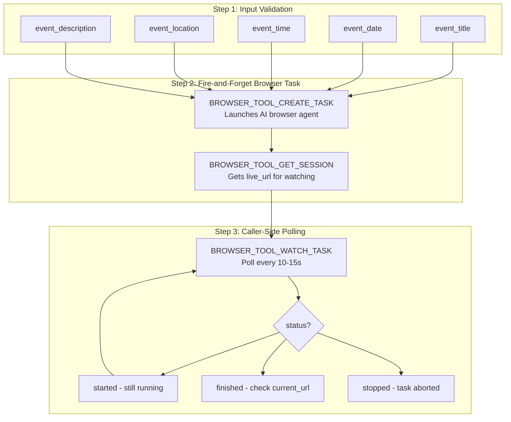
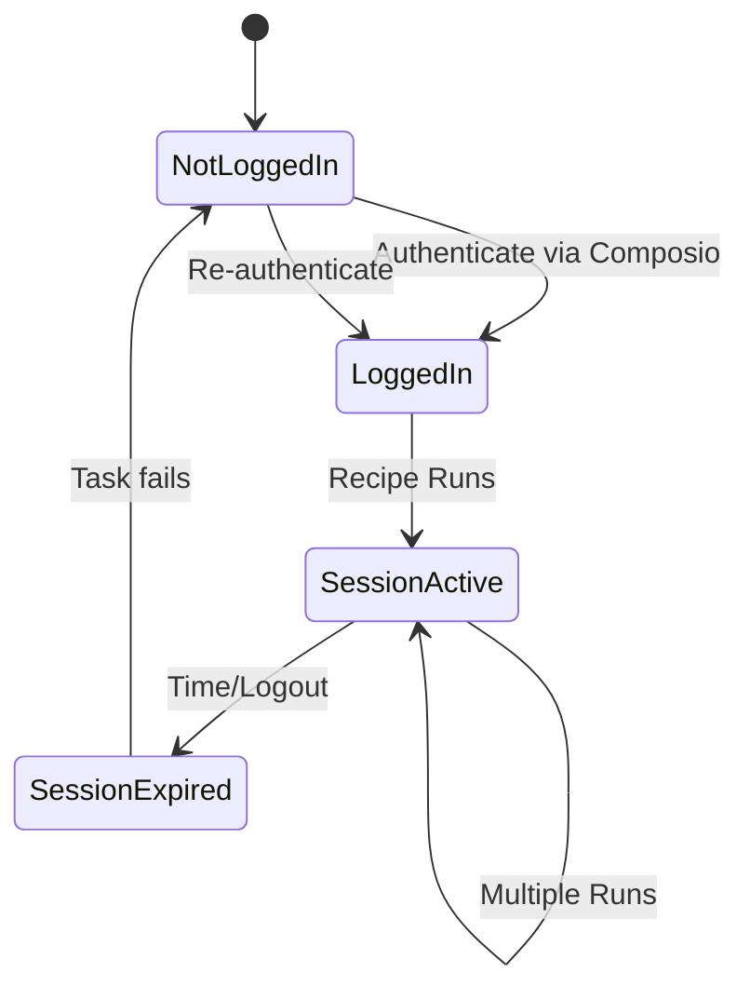

# Event Creation Recipes - Detailed Documentation

## Per-Platform Recipes

| Platform | Recipe ID | Create URL |
|----------|-----------|------------|
| Luma | `rcp_mXyFyALaEsQF` | `https://lu.ma/create` |
| Meetup | `rcp_kHJoI1WmR3AR` | `https://www.meetup.com/<group>/events/create/` |
| Partiful | `rcp_bN7jRF5P_Kf0` | `https://partiful.com/create` |

## Overview

Each recipe creates an event on a single platform using browser automation. Recipes are designed to be run sequentially (one platform at a time) since browser automation sessions cannot overlap. Each recipe uses the fire-and-forget pattern: it starts an AI browser agent via `BROWSER_TOOL_CREATE_TASK` and returns immediately with a `task_id` for caller-side polling.

## Why Browser Automation?

| Platform | Public API | Event Creation API | Our Approach |
|----------|------------|-------------------|--------------|
| Luma | None | None | Browser automation |
| Partiful | None | None | Browser automation |
| Meetup | GraphQL | Available | Browser for consistency |

Luma and Partiful have no public APIs, so browser automation is the only programmatic option.

## Architecture



## Input Parameters

### Required Parameters (all platforms)

| Parameter | Type | Description | Example |
|-----------|------|-------------|---------|
| `event_title` | string | The name/title of your event | "AI Workshop: Building with Claude" |
| `event_date` | string | Date in natural language | "January 25, 2025" or "Next Saturday" |
| `event_time` | string | Time with timezone | "6:00 PM EST" or "18:00 Eastern" |
| `event_location` | string | Venue name or full address | "The Station, 3rd Floor, 1500 Sansom St, Philadelphia, PA" |
| `event_description` | string | Full event description (apostrophes auto-converted to curly quotes) | "Join us for a hands-on workshop where we'll explore..." |

### Optional Parameters (platform-specific)

| Parameter | Platform | Default | Description |
|-----------|----------|---------|-------------|
| `luma_create_url` | Luma | `https://lu.ma/create` | Override the Luma create page URL |
| `meetup_group_url` | Meetup | `https://www.meetup.com/code-coffee-philly` | Override the Meetup group URL |
| `partiful_create_url` | Partiful | `https://partiful.com/create` | Override the Partiful create page URL |

## Output Format

Each recipe returns immediately with:

```json
{
  "platform": "luma|meetup|partiful",
  "status": "running",
  "task_id": "<use for BROWSER_TOOL_WATCH_TASK>",
  "session_id": "<browser session>",
  "live_url": "https://...",
  "event_url": "",
  "error": null,
  "success_url_pattern": "<platform-specific pattern>"
}
```

### Polling Response (via BROWSER_TOOL_WATCH_TASK)

| Field | Description |
|-------|-------------|
| `status` | `"started"` (still running), `"finished"` (done), `"stopped"` (aborted) |
| `current_url` | The browser's current URL - check against success pattern |
| `is_success` | Boolean indicating if task completed successfully |
| `output` | Task output text |

### Success URL Patterns

| Platform | Success Pattern |
|----------|----------------|
| Luma | URL contains `lu.ma/` but NOT `/create` or `/home` |
| Meetup | URL contains `meetup.com` and `/events/` but NOT `/create` |
| Partiful | URL contains `partiful.com/e/` |

## Example Usage

### Create Event on Luma

```python
# Phase 1: Start the task
RUBE_EXECUTE_RECIPE(
    recipe_id="rcp_mXyFyALaEsQF",
    input_data={
        "event_title": "AI Workshop: Building with Claude",
        "event_date": "January 25, 2025",
        "event_time": "6:00 PM EST",
        "event_location": "The Station, Philadelphia",
        "event_description": "Join us for a hands-on workshop..."
    }
)
# Returns: {task_id, live_url, status: "running"}

# Phase 2: Poll for completion
RUBE_MULTI_EXECUTE_TOOL(
    tool_slug="BROWSER_TOOL_WATCH_TASK",
    arguments={"taskId": "<task_id from Phase 1>"}
)
# Returns: {status: "started"|"finished"|"stopped", current_url: "..."}
```

### Create Event on Meetup

```python
RUBE_EXECUTE_RECIPE(
    recipe_id="rcp_kHJoI1WmR3AR",
    input_data={
        "event_title": "AI Workshop: Building with Claude",
        "event_date": "January 25, 2025",
        "event_time": "6:00 PM EST",
        "event_location": "The Station, Philadelphia",
        "event_description": "Join us for a hands-on workshop...",
        "meetup_group_url": "https://www.meetup.com/code-coffee-philly"
    }
)
```

### Create Event on Partiful

```python
RUBE_EXECUTE_RECIPE(
    recipe_id="rcp_bN7jRF5P_Kf0",
    input_data={
        "event_title": "AI Workshop: Building with Claude",
        "event_date": "January 25, 2025",
        "event_time": "6:00 PM EST",
        "event_location": "The Station, Philadelphia",
        "event_description": "Join us for a hands-on workshop..."
    }
)
```

## Platform-Specific Details

### Luma (lu.ma)

**Create URL:** `https://lu.ma/create`

**Login Methods:**
- Google SSO
- Email/Password
- Magic Link

**Form Fields Filled:**
- Event Title
- Date/Time Picker
- Location (with Google Places autocomplete)
- Description (rich text)
- Cover Image (optional)

**Known Quirks:**
- React-based UI with dynamic elements
- Date picker requires specific interaction pattern - task instructions include explicit 2s waits
- Cover image upload needs URL (not file upload)

### Meetup

**Create URL:** `https://www.meetup.com/<group>/events/create/`

**Login Methods:**
- Email/Password
- Google SSO
- Facebook SSO
- Apple SSO

**Form Fields Filled:**
- Event Title
- Date and Time
- Venue/Location (with venue search)
- Description (rich text editor)
- Event Type
- Photo (optional)

**Known Quirks:**
- Complex multi-step form
- Aggressive anti-bot detection - task instructions include 2s waits between form actions
- Venue search can be slow
- Rich text editor has specific formatting
- Must be an organizer of the group
- Group URL defaults to `https://www.meetup.com/code-coffee-philly`, overridable via `meetup_group_url`

### Partiful

**Create URL:** `https://partiful.com/create`

**Login Methods:**
- Phone Number + SMS
- Google SSO

**Form Fields Filled:**
- Event Title
- Date/Time
- Location
- Description
- Cover Image
- RSVP Options

**Known Quirks:**
- Mobile-first design
- Emoji-friendly platform
- Theme/Effect customization available
- Guest capacity settings
- Share modal after creation - browser agent dismisses it before URL extraction
- Recurring events NOT supported

## Session Management

Browser sessions persist across recipe executions. To maintain sessions:

1. **Initial Login:** Log in once via Composio connected accounts
2. **Session Persists:** Subsequent runs use existing session
3. **Session Expires:** Re-login when the browser task navigates to a login page instead of the create form



## Best Practices

1. **Test Login First:** Before running for real events, verify you're logged into all platforms
2. **Use skip_platforms:** If one platform has issues, skip it rather than failing entirely
3. **Poll patiently:** Browser tasks can take 30-90 seconds to complete
4. **Watch the live_url:** Share with user so they can observe the browser in real time
5. **Run During Low Traffic:** Platform UIs respond better during off-peak hours
