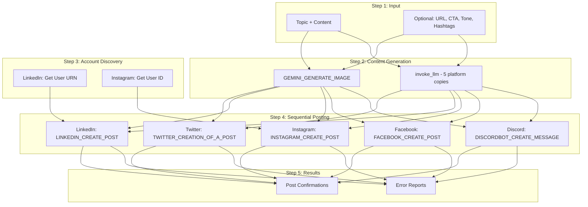

# Generic Social Post Recipe - Detailed Documentation

**Recipe ID:** `rcp_PLACEHOLDER`
**Recipe URL:** [View on Rube](https://rube.app)

## Overview

This recipe posts generic content (not event-specific) across 5 social media platforms using direct API integrations:
- **Twitter/X** - Tweet with image
- **LinkedIn** - Professional post
- **Instagram** - Photo post with caption
- **Facebook** - Page post
- **Discord** - Channel message

Use this for community updates, tech news, sponsor shout-outs, recaps, announcements, or any content that isn't a specific event.

For event promotion (with date, time, location, RSVP link), use the [Social Promotion Recipe](social-promotion.md) instead.

## Architecture



## Input Parameters

### Required Parameters

| Parameter | Type | Max Length | Description | Example |
|-----------|------|-----------|-------------|---------|
| `topic` | string | 200 | What the post is about | "New Community Partnership" |
| `content` | string | 5000 | Main message/body text | "We're excited to announce..." |

### Optional Parameters

| Parameter | Type | Max Length | Default | Description |
|-----------|------|-----------|---------|-------------|
| `url` | string | - | "" | Link to include in posts |
| `cta` | string | 200 | "" | Call-to-action (e.g. "Join us", "Read more") |
| `image_url` | string | - | "" | Reuse existing image (skips Gemini) |
| `image_prompt` | string | 500 | "" | Custom Gemini prompt for image generation |
| `tone` | string | 50 | "engaging" | Style: engaging, professional, casual, excited, informative |
| `hashtags` | string | 500 | "" | Custom hashtags to include |
| `discord_channel_id` | string | - | "" | Discord channel for announcement |
| `facebook_page_id` | string | - | "" | Facebook page to post to |
| `skip_platforms` | string | - | "" | Platforms to skip (comma-separated) |

### Image Generation Precedence

1. **`image_url`** provided: Use it directly, skip Gemini
2. **`image_prompt`** provided: Use as custom Gemini prompt
3. **Neither provided**: Auto-generate prompt from `topic` and `tone`

## Output Format

```json
{
  "twitter_posted": "success",
  "linkedin_posted": "success",
  "instagram_posted": "success",
  "facebook_posted": "success",
  "discord_posted": "success",
  "image_url": "https://storage.googleapis.com/...",
  "summary": "Posted to 5/5 platforms"
}
```

## Platform-Specific Details

### Twitter/X

**API Tool:** `TWITTER_CREATION_OF_A_POST`

**Limits:**
- 280 characters for text
- Image URL appended separately
- Hashtags included by LLM

### LinkedIn

**API Tools:**
1. `LINKEDIN_GET_MY_INFO` - Get user URN
2. `LINKEDIN_CREATE_LINKED_IN_POST` - Create post

**Auto-Discovery:**
The recipe automatically discovers your LinkedIn URN via `LINKEDIN_GET_MY_INFO`.

### Instagram

**API Tools:**
1. `INSTAGRAM_GET_USER_INFO` - Get user ID
2. `INSTAGRAM_CREATE_MEDIA_CONTAINER` - Create media container
3. `INSTAGRAM_GET_POST_STATUS` - Poll container status
4. `INSTAGRAM_CREATE_POST` - Publish container

**Requirements:**
- Must have a Business or Creator account
- Image URL must be publicly accessible
- Caption up to 2,200 characters
- Skipped if no image is available

### Facebook

**API Tool:** `FACEBOOK_CREATE_POST`

**Requirements:**
- Must have a Facebook Page (not personal profile)
- Page ID must be provided
- `pages_manage_posts` permission required

### Discord

**API Tool:** `DISCORDBOT_CREATE_MESSAGE`

**Requirements:**
- Bot must be added to server
- Bot must have send message permissions
- Channel ID must be provided

## AI Content Generation

### Image Generation

Three modes, in priority order:

**1. Reuse existing image:**
```python
# image_url input provided - no Gemini call
```

**2. Custom prompt:**
```python
# image_prompt input provided
prompt = image_prompt  # Used as-is
```

**3. Auto-generated prompt:**
```python
prompt = f"Create a modern, eye-catching social media graphic about: {topic}. Style: {tone}, vibrant colors, suitable for social media. Do not include any text in the image."
```

### Platform-Specific Copy

```python
prompt = f"""Generate 5 platform-specific social media posts about this topic:

Topic: {topic}
Content: {content}
Link: {url}  (if provided)
Call to action: {cta}  (if provided)
Hashtags to include: {hashtags}  (if provided)
Tone: {tone}

Return JSON with keys: twitter, linkedin, instagram, facebook, discord

Guidelines:
- Twitter: Concise, hashtags, under 280 chars
- LinkedIn: Professional, detailed, industry-focused
- Instagram: Engaging, emoji-friendly, hashtags
- Facebook: Conversational, community-focused
- Discord: Markdown formatting, casual tone
- If a link was provided, include it naturally in each post
- If a call to action was provided, incorporate it
"""
```

## Example Usage

### Community Update

```python
RUBE_EXECUTE_RECIPE(
    recipe_id="rcp_PLACEHOLDER",
    input_data={
        "topic": "New Community Partnership",
        "content": "We're excited to announce our partnership with TechHub Philly! This brings new co-working spaces, mentorship programs, and networking opportunities to our community.",
        "url": "https://example.com/partnership",
        "cta": "Learn more about the partnership",
        "tone": "excited",
        "discord_channel_id": "1234567890123456789",
        "facebook_page_id": "9876543210"
    }
)
```

### Tech News

```python
RUBE_EXECUTE_RECIPE(
    recipe_id="rcp_PLACEHOLDER",
    input_data={
        "topic": "Claude 4 Release",
        "content": "Anthropic just released Claude 4 with groundbreaking capabilities. Here's what it means for our community of developers building AI applications.",
        "url": "https://anthropic.com/news",
        "tone": "informative",
        "hashtags": "#AI #Claude #Anthropic #MachineLearning"
    }
)
```

### Sponsor Shout-Out

```python
RUBE_EXECUTE_RECIPE(
    recipe_id="rcp_PLACEHOLDER",
    input_data={
        "topic": "Thank You to Our Sponsors",
        "content": "A huge thank you to our amazing sponsors who make Code Coffee Philly possible. Your support fuels innovation and community growth.",
        "tone": "professional",
        "image_prompt": "Create a warm, professional thank-you graphic with coffee and technology themes. Vibrant but elegant. No text.",
        "skip_platforms": "twitter"
    }
)
```

### Skip Platforms

```python
RUBE_EXECUTE_RECIPE(
    recipe_id="rcp_PLACEHOLDER",
    input_data={
        "topic": "Quick Update",
        "content": "New meetup location starting next month!",
        "skip_platforms": "facebook,instagram"
    }
)
```

## Comparison with Event Social Promotion

| Feature | Social Post (this recipe) | Social Promotion |
|---------|---------------------------|------------------|
| Recipe ID | `rcp_PLACEHOLDER` | `rcp_X65IirgPhwh3` |
| Use case | General content | Event promotion |
| Required inputs | `topic`, `content` | `event_title`, `event_date`, `event_time`, `event_location`, `event_description`, `event_url` |
| URL handling | Optional, generic | Required, labeled "RSVP" |
| Tone control | Yes (`tone` param) | No (always professional/event-style) |
| Custom image prompt | Yes (`image_prompt` param) | No (auto-generated from event title) |
| CTA support | Yes (`cta` param) | No |
| Hashtag control | Yes (`hashtags` param) | No (LLM decides) |

## Connection Setup

Same platform connections as the event social promotion recipe. See [social-promotion.md](social-promotion.md#connection-setup) for details.

## Best Practices

1. **Test with skip_platforms:** Start by testing one platform at a time
2. **Use tone appropriately:** Match the tone to your content type
3. **Provide hashtags for Twitter/Instagram:** These platforms benefit most from hashtags
4. **Include a URL when possible:** Posts with links get more engagement
5. **Use image_prompt for brand consistency:** Custom prompts produce more relevant images than auto-generation
6. **Verify connections:** Ensure all OAuth connections are active before running
