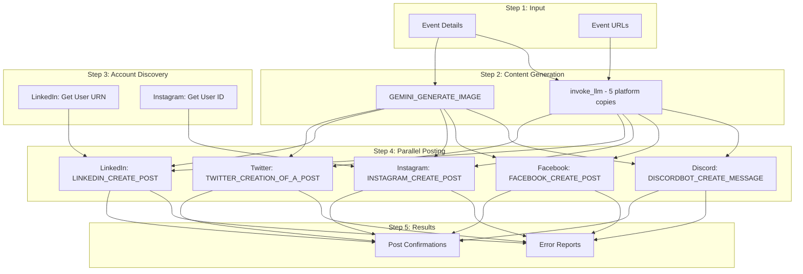
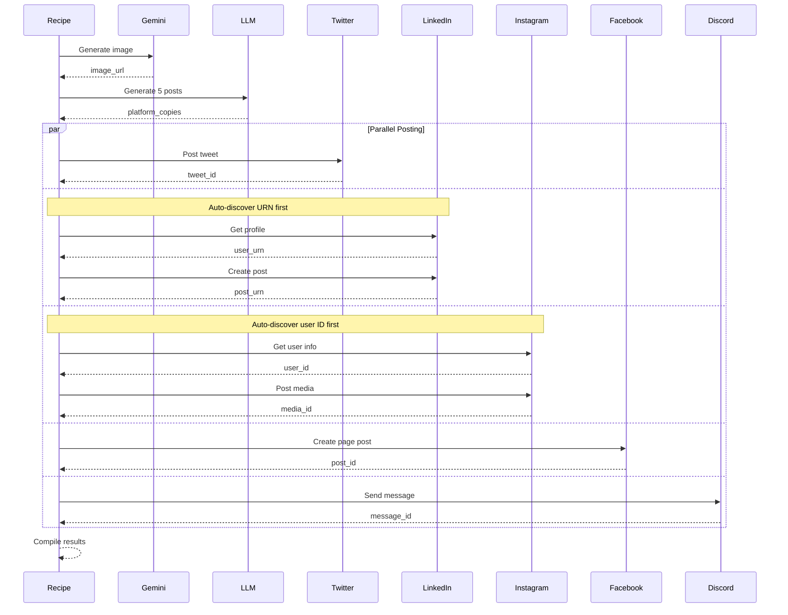
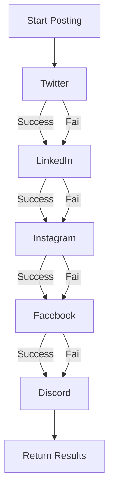

# Social Promotion Recipe - Detailed Documentation

**Recipe ID:** `rcp_X65IirgPhwh3`
**Recipe URL:** [View on Rube](https://rube.app)

## Overview

This recipe promotes events across 5 social media platforms using direct API integrations:
- **Twitter/X** - Tweet with image
- **LinkedIn** - Professional post
- **Instagram** - Photo post with caption
- **Facebook** - Page post
- **Discord** - Channel message

## Why API Integration?

Unlike event platforms, social media platforms have robust APIs:

| Platform | API Type | Authentication |
|----------|----------|----------------|
| Twitter/X | REST API v2 | OAuth 2.0 |
| LinkedIn | REST API | OAuth 2.0 |
| Instagram | Graph API | OAuth 2.0 |
| Facebook | Graph API | OAuth 2.0 |
| Discord | Bot API | Bot Token |

## Architecture



## Input Parameters

### Required Parameters

| Parameter | Type | Description | Example |
|-----------|------|-------------|---------|
| `event_title` | string | Event name | "AI Workshop" |
| `event_date` | string | Event date | "January 25, 2025" |
| `event_time` | string | Event time | "6:00 PM EST" |
| `event_location` | string | Event venue | "The Station, Philadelphia" |
| `event_description` | string | Event description | "Join us for..." |
| `event_url` | string | Primary RSVP link | "https://lu.ma/abc123" |

### Optional Parameters

| Parameter | Type | Default | Description |
|-----------|------|---------|-------------|
| `discord_channel_id` | string | "" | Discord channel for announcement |
| `facebook_page_id` | string | "" | Facebook page to post to |
| `skip_platforms` | string | "" | Platforms to skip (comma-separated) |

## Output Format

```json
{
  "twitter_posted": "success",
  "linkedin_posted": "success",
  "instagram_posted": "success",
  "facebook_posted": "success",
  "discord_posted": "success",
  "image_url": "https://storage.googleapis.com/...",
  "summary": "Posted to 5/5 platforms"
}
```

## Platform-Specific Details

### Twitter/X

**API Tool:** `TWITTER_CREATION_OF_A_POST`

**Content Format:**
```
{event_title}

{event_date} | {event_time}
{event_location}

RSVP: {event_url}

{image_url}
```

**Limits:**
- 280 characters for text
- Image URL appended separately
- Hashtags added automatically

**Example Output:**
```
AI Workshop: Building with Claude

Jan 25, 2025 | 6:00 PM EST
The Station, Philadelphia

RSVP: https://lu.ma/abc123

#AI #Workshop #Philadelphia #Tech
```

### LinkedIn

**API Tools:**
1. `LINKEDIN_GET_MY_INFO` - Get user URN
2. `LINKEDIN_CREATE_LINKED_IN_POST` - Create post

**Content Format:**
```
Professional announcement about {event_title}

{detailed_description}

Date: {event_date}
Time: {event_time}
Location: {event_location}

Register here: {event_url}
```

**Auto-Discovery:**
The recipe automatically discovers your LinkedIn URN:
```python
profile = LINKEDIN_GET_MY_INFO()
urn = f"urn:li:person:{profile['sub']}"
```

### Instagram

**API Tools:**
1. `INSTAGRAM_GET_USER_INFO` - Get user ID
2. `INSTAGRAM_CREATE_MEDIA_CONTAINER` - Create media container
3. `INSTAGRAM_GET_POST_STATUS` - Poll container status
4. `INSTAGRAM_CREATE_POST` - Publish container

**Requirements:**
- Must have a Business or Creator account
- Image URL must be publicly accessible
- Caption up to 2,200 characters

**Content Format:**
```
{event_title}

{description_with_emojis}

{event_date} | {event_time}
{event_location}

Link in bio or DM for details!

#event #community #philadelphia
```

### Facebook

**API Tool:** `FACEBOOK_CREATE_POST`

**Requirements:**
- Must have a Facebook Page (not personal profile)
- Page ID must be provided
- `pages_manage_posts` permission required

**Content Format:**
```
{event_title}

{full_description}

{event_date} at {event_time}
{event_location}

RSVP: {event_url}
```

### Discord

**API Tool:** `DISCORDBOT_CREATE_MESSAGE`

**Requirements:**
- Bot must be added to server
- Bot must have send message permissions
- Channel ID must be provided

**Content Format:**
```markdown
**{event_title}**

{description}

{event_date} at {event_time}
{event_location}

RSVP: {event_url}
```

## AI Content Generation

### Image Generation

```python
prompt = f"""
Create a modern, eye-catching event promotional graphic for: {event_title}
Style: professional, vibrant colors, suitable for social media
Aspect ratio: 1:1 (square, works on all platforms)
Do not include any text in the image.
"""
```

### Platform-Specific Copy

```python
prompt = f"""
Generate 5 platform-specific social media posts for this event:

Event: {event_title}
Date: {event_date} at {event_time}
Location: {event_location}
Description: {event_description}
RSVP Link: {event_url}

Return JSON with keys: twitter, linkedin, instagram, facebook, discord

Guidelines:
- Twitter: Concise, hashtags, under 280 chars
- LinkedIn: Professional, detailed, industry-focused
- Instagram: Engaging, emoji-friendly, hashtags
- Facebook: Conversational, community-focused
- Discord: Markdown formatting, casual tone
"""
```

## Execution Flow



## Error Handling

### Graceful Degradation

The recipe continues posting to other platforms if one fails:



### Common Errors

| Platform | Error | Cause | Solution |
|----------|-------|-------|----------|
| Twitter | Rate limit | Too many posts | Wait 15 minutes |
| LinkedIn | Invalid URN | Profile not found | Re-authorize connection |
| Instagram | Image error | URL not accessible | Use public image URL |
| Facebook | Permissions | Missing page access | Re-authorize with permissions |
| Discord | Channel error | Invalid channel ID | Verify channel ID |

## Example Usage

### Full Promotion

```python
RUBE_EXECUTE_RECIPE(
    recipe_id="rcp_X65IirgPhwh3",
    input_data={
        "event_title": "AI Workshop: Building with Claude",
        "event_date": "January 25, 2025",
        "event_time": "6:00 PM EST",
        "event_location": "The Station, Philadelphia",
        "event_description": "Join us for a hands-on workshop where we'll explore building AI applications with Claude...",
        "event_url": "https://lu.ma/abc123",
        "discord_channel_id": "1234567890123456789",
        "facebook_page_id": "9876543210"
    }
)
```

### Skip Problematic Platforms

```python
RUBE_EXECUTE_RECIPE(
    recipe_id="rcp_X65IirgPhwh3",
    input_data={
        "event_title": "AI Workshop",
        "event_date": "January 25, 2025",
        "event_time": "6:00 PM EST",
        "event_location": "Philadelphia",
        "event_description": "Workshop...",
        "event_url": "https://lu.ma/abc123",
        "skip_platforms": "facebook,discord"  # Skip if not configured
    }
)
```

## Connection Setup

### Twitter
1. Go to Composio dashboard
2. Connect Twitter account
3. Authorize posting permissions

### LinkedIn
1. Connect LinkedIn account
2. Authorize profile and posting permissions
3. URN is auto-discovered

### Instagram
1. Must have Business/Creator account
2. Connect via Facebook Business
3. Authorize media posting

### Facebook
1. Connect Facebook account
2. Select page to manage
3. Grant `pages_manage_posts` permission

### Discord
1. Create a Discord bot
2. Add bot to your server
3. Provide bot token to Composio
4. Get channel ID from Discord

## Best Practices

1. **Test with skip_platforms:** Start by testing one platform at a time
2. **Verify connections:** Ensure all OAuth connections are active before running
3. **Check image accessibility:** Generated images must be publicly accessible
4. **Monitor rate limits:** Don't run too frequently on Twitter
5. **Use channel IDs correctly:** Discord and Facebook require specific IDs
