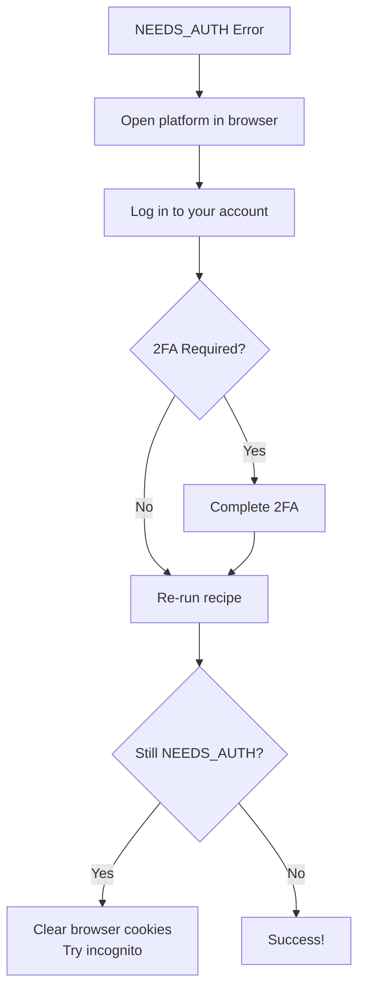
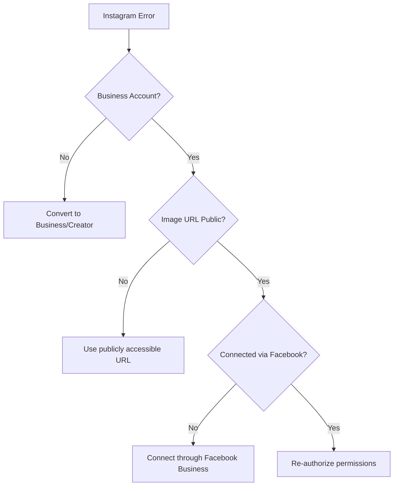

# Troubleshooting Guide

Common issues and solutions for the CCP Digital Marketing automation system.

## Table of Contents

- [Event Creation Issues](#event-creation-issues)
- [Social Promotion Issues](#social-promotion-issues)
- [Connection Issues](#connection-issues)
- [AI Generation Issues](#ai-generation-issues)

---

## Event Creation Issues

### NEEDS_AUTH Status

**Symptom:** Recipe returns `NEEDS_AUTH` for a platform

**Cause:** Browser session is not logged into the platform

**Solution:**


### NEEDS_REVIEW Status

**Symptom:** Recipe returns `NEEDS_REVIEW` - uncertain if event was published

**Cause:** Form was submitted but event URL couldn't be captured

**Solution:**
1. Log into the platform manually
2. Check for draft/pending events
3. Look in "My Events" or similar section
4. Publish manually if event is in draft

### Form Filling Fails

**Symptom:** Browser automation can't find form fields

**Cause:** Platform UI has changed

**Solution:**
1. Report the issue on GitHub
2. Use `skip_platforms` to exclude problematic platform
3. Create event manually on that platform

### Meetup Group Access Denied

**Symptom:** Can't create events on Meetup

**Cause:** Not an organizer of the Meetup group

**Solution:**
1. Verify you're an organizer/co-organizer
2. Check the `meetup_group_url` is correct
3. Ensure URL format is `https://www.meetup.com/your-group-name`

---

## Social Promotion Issues

### Twitter Post Fails

**Symptom:** `twitter_posted: "failed: ..."`

**Common Causes:**

| Error | Cause | Solution |
|-------|-------|----------|
| Rate limit exceeded | Too many posts | Wait 15 minutes |
| Duplicate content | Same tweet posted recently | Change content slightly |
| Authentication failed | Token expired | Re-authorize in Composio |

### LinkedIn Post Fails

**Symptom:** `linkedin_posted: "failed: ..."`

**Common Causes:**

| Error | Cause | Solution |
|-------|-------|----------|
| Invalid URN | Can't find user profile | Re-authorize LinkedIn |
| Access denied | Permissions revoked | Re-connect with posting permissions |
| Content too long | Exceeded character limit | Shorten description |

### Instagram Post Fails

**Symptom:** `instagram_posted: "failed: ..."`

**Requirements Check:**


### Facebook Page Post Fails

**Symptom:** `facebook_posted: "failed: ..."`

**Common Issues:**

1. **No page_id provided:** Recipe needs your Facebook Page ID
2. **Wrong permissions:** Need `pages_manage_posts` permission
3. **Page not connected:** Connect page in Composio

**Finding your Page ID:**
1. Go to your Facebook Page
2. Click "About"
3. Scroll to "Page ID" section

### Discord Message Fails

**Symptom:** `discord_posted: "failed: ..."`

**Common Issues:**

1. **Invalid channel_id:** Verify the channel ID is correct
2. **Bot not in server:** Add the bot to your Discord server
3. **Missing permissions:** Bot needs "Send Messages" permission

**Getting Channel ID:**
1. Enable Developer Mode in Discord settings
2. Right-click channel → "Copy ID"

---

## Connection Issues

### Composio Connection Expired

**Symptom:** API calls fail with authentication errors

**Solution:**
1. Go to [Composio Dashboard](https://composio.dev)
2. Navigate to Connections
3. Find the expired connection
4. Click "Reconnect" or "Refresh"

### Browser Session Expired

**Symptom:** Event creation returns NEEDS_AUTH for all platforms

**Solution:**
1. The browser automation uses persistent sessions
2. Sessions can expire after inactivity
3. Log into each platform manually to refresh session
4. Re-run the recipe

### Multiple Account Confusion

**Symptom:** Posting to wrong account

**Solution:**
1. Check which accounts are connected in Composio
2. Disconnect unwanted accounts
3. Connect the correct account
4. Verify with a test post

---

## AI Generation Issues

### Image Generation Fails

**Symptom:** `image_url` is empty or image looks wrong

**Causes:**

| Issue | Solution |
|-------|----------|
| Gemini quota exceeded | Wait or upgrade plan |
| Inappropriate content detected | Modify event description |
| Network timeout | Retry the recipe |

### Description Generation Fails

**Symptom:** All platforms get the same generic description

**Cause:** LLM couldn't parse the prompt correctly

**Impact:** Recipe still works, just with less optimized content

**Solution:**
1. This is non-critical - recipe continues
2. Edit posts manually if needed
3. Report persistent issues

---

## Quick Fixes

### Reset Everything

If multiple things are broken:

```bash
# 1. Clear all Composio connections
# Go to Composio Dashboard → Connections → Remove all

# 2. Re-connect each service:
# - Twitter
# - LinkedIn
# - Instagram (via Facebook)
# - Facebook
# - Discord

# 3. Log into event platforms:
# - lu.ma
# - meetup.com
# - partiful.com

# 4. Test with a single platform first
```

### Skip Problematic Platforms

When you need to post urgently:

```python
# Skip event platforms with issues
RUBE_EXECUTE_RECIPE(
    recipe_id="rcp_xvediVZu8BzW",
    input_data={
        ...,
        "skip_platforms": "meetup"  # Skip Meetup
    }
)

# Skip social platforms with issues
RUBE_EXECUTE_RECIPE(
    recipe_id="rcp_zBzqs2LO-miP",
    input_data={
        ...,
        "skip_platforms": "facebook,discord"  # Skip FB and Discord
    }
)
```

---

## Getting Help

### Report an Issue

1. Go to [GitHub Issues](https://github.com/Coffee-Code-Philly-Accelerator/CCP-Digital-Marketing/issues)
2. Include:
   - Recipe ID
   - Error message
   - Platform(s) affected
   - Steps to reproduce

### Composio Support

For API connection issues:
- [Composio Documentation](https://composio.dev/docs)
- [Composio Discord](https://discord.gg/composio)

### Platform-Specific Help

| Platform | Documentation |
|----------|--------------|
| Twitter | [Developer Portal](https://developer.twitter.com) |
| LinkedIn | [Marketing API](https://docs.microsoft.com/linkedin) |
| Instagram | [Graph API](https://developers.facebook.com/docs/instagram-api) |
| Facebook | [Graph API](https://developers.facebook.com/docs/graph-api) |
| Discord | [Developer Portal](https://discord.com/developers) |
